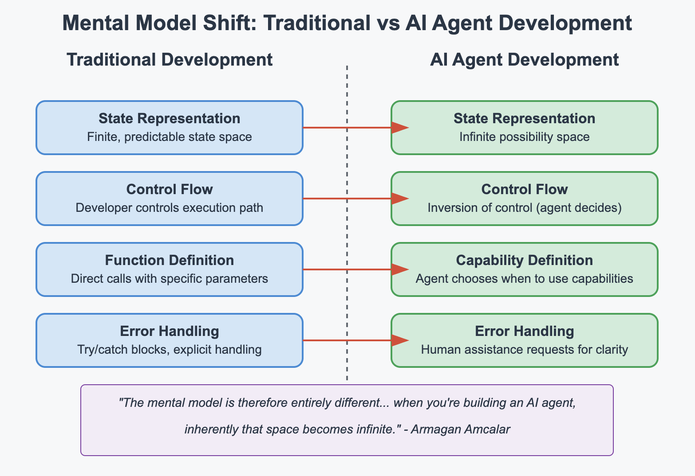

# AI Agent Workshop

## Understanding the Mental Model Shift

Traditional software development offers many transferable skills when learning AI agent development, but it require a different way of thinking:

### Traditional Development
- **State Management**: Finite, predictable state
- **Control Flow**: Developer controls execution path
- **Input/Output**: Well-defined, structured I/O
- **Errors**: Explicit error handling

### AI Agent Development
- **State**: Infinite possibility space
- **Control Flow**: Inversion of control (agent decides)
- **Input/Output**: Natural language, unstructured
- **Errors**: Requires human assistance for clarity

This workshop guides you through building an AI agent with OpenServ, focusing on:
1. Defining capabilities, not just functions
2. Working with the inversion of control pattern
3. Creating multi-agent systems for emergent behavior

## The Paradigm Shift: From Software Engineering to AI Agent Development 

The transition from traditional software engineering to AI agent development represents a mental model shift. This transformation challenges the fundamental principles that have guided software development for decades, requiring engineers to reimagine their approach to problem-solving, system design, and user interaction.

Traditional software engineering operates within a deterministic paradigm. Engineers meticulously define the exact behavior of their systems through explicit instructions, controlling every aspect of execution flow. They create applications with predictable state spaces, where inputs lead to outputs through clearly defined pathways. Error handling follows structured patterns of try-catch blocks and explicit exception management. In this world, the developer maintains absolute control, and the software faithfully executes precisely as instructed.

As Armağan Amcalar, founder of Coyotiv School of Software Engineering and CTO of OpenServ eloquently explains:

>The mental model is therefore entirely different. In a UI application, you have maybe some state, some deterministic state that you show to the user... The possible scenarios or the possible space of the state representation is really tiny. Whereas when you're building an AI agent, inherently that space becomes infinite. 

This observation captures the essence of the paradigm shift.

AI agent development inverts this control relationship. Rather than dictating exact behaviors, engineers define capabilities and parameters, then surrender control to the agent itself. The agent, powered by large language models, independently decides which capabilities to invoke and when, based on its interpretation of user intent. This inversion of control creates an infinite possibility space, where the same input might produce different outputs depending on context, prior interactions, and the agent's evolving understanding.

Error handling similarly transforms from explicit exception catching to human assistance requests. When an agent encounters ambiguity or lacks critical information, it doesn't crash or fail silently – it initiates a clarification dialogue with users. This human-in-the-loop approach represents a fundamental departure from traditional error management.

Perhaps most significantly, AI agent development requires engineers to think in terms of emergent behavior rather than explicit programming. Engineers no longer implement exact solutions but rather create environments where desirable behaviors can emerge through the interaction of capabilities, memory systems, and reasoning patterns. Success comes not from writing perfect algorithms but from skillfully guiding and constraining generative processes.

This mental model shift demands that engineers develop new instincts and approaches. They must become comfortable with probabilistic outcomes rather than deterministic ones. They must learn to express desired behaviors through system prompts and capability definitions rather than imperative code. They must develop testing methodologies that accommodate a range of acceptable outputs rather than exact matches.

The rewards of mastering this new paradigm are substantial. Engineers who successfully make this transition can create systems with unprecedented adaptability and natural interaction patterns. Their applications can understand nuance, accommodate ambiguity, and evolve without explicit reprogramming. However, this potential comes with the responsibility to ensure these systems remain aligned with human values and expectations.

The transition between traditional software engineering and AI agent development is a fundamental reimagining of the relationship between humans, code, and computation - —one that requires equal attention to technical implementation and ethical consideration. 
