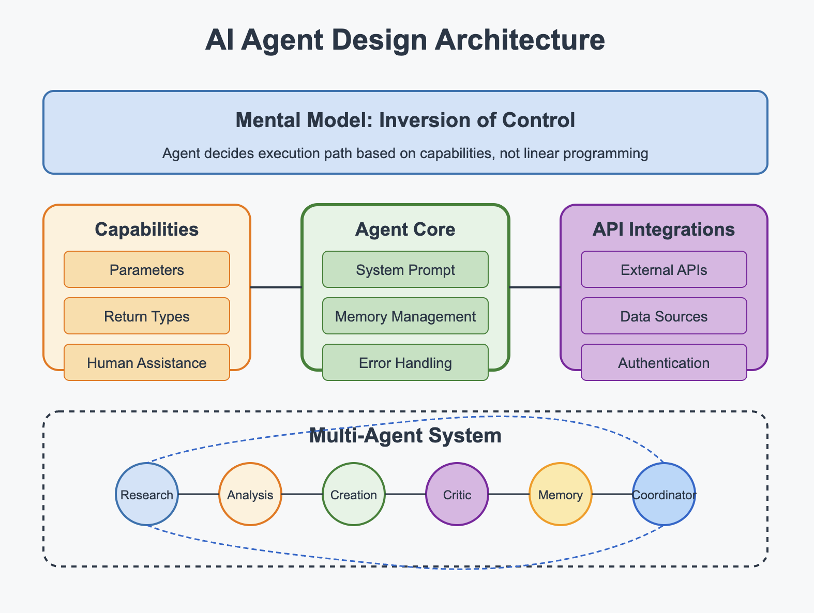

# AI Agent Design: Where Software Engineering Meets Artificial Intelligence

The emergence of AI agents represents a fascinating convergence of traditional software engineering and artificial intelligence. This new paradigm demands a blend of established development practices and novel approaches to create systems that can perceive, decide, and act with increasing autonomy. This essay explores the complete lifecycle of AI agent design, highlighting where conventional software engineering principles apply and where new AI-specific knowledge becomes essential.

The mental shift represents the first challenge for developers entering the AI agent space. Software engineers with experience in event-driven programming or callback-based systems may find this transition somewhat familiar, as these paradigms also involve surrendering direct control of execution flow. However, the scale and complexity of decision-making in AI agents far exceeds these more limited patterns.

AI agent developer is sort of a hybrid engineer, combining traditional software engineering expertise with AI-specific knowledge. 

**From traditional software engineering**: Clean architecture, robust API design, effective error handling, security practices, and user-centered design.

**From AI and machine learning**: Prompt engineering, vector embeddings, model selection, semantic evaluation, and understanding of emergent behaviors.

## User Input Design: The Gateway to Intent

The journey of an AI agent begins with user input, which can take multiple forms:

1. **Text-based prompts**: The most common form of interaction, where software engineering principles of input validation and sanitization remain crucial.
2. **Voice commands**: Requiring integration with speech-to-text services, where traditional audio processing knowledge combines with natural language understanding.
3. **Document/file uploads**: Where conventional file handling meets content extraction and semantic understanding.
4. **Visual input**: Where computer vision techniques must be integrated with reasoning capabilities.

The design of input mechanisms represents an area where traditional software engineering practices remain highly relevant. Well-structured APIs, clean separation of concerns, and robust error handling are essential for creating reliable input channels. However, unlike traditional applications, AI agents must be designed to handle ambiguity and incomplete information gracefully.

For example, when developing text input mechanisms, software engineers might implement standard validation patterns but must also consider how to preserve context across interactions. This is where knowledge of conversational state management becomes valuable, bridging traditional session handling with AI-specific conversational context preservation.

## The Agent Core: Capabilities, Memory, and Decision-Making

A core architecture of an AI agent typically comprises:

**Model integration**: Selecting and connecting to appropriate model, commonly a large language model (LLMs) like GPT-4, Claude, or open-source alternatives like Llama.

**Capability definitions**: Creating well-defined functions that the agent can invoke to perform specific tasks.

**Memory management**: Systems for retaining information across interactions.

**Human assistance mechanisms**: Protocols for requesting clarification when needed.

This is where the blend of software engineering and AI knowledge becomes most apparent. Software engineers will recognize the importance of clean interfaces and separation of concerns when defining capabilities. Each capability should follow principles similar to well-designed functions: clear inputs, predictable outputs, and focused responsibility.

For example, a capability to search a knowledge base might be implemented using traditional software engineering patterns for database queries and result pagination. However, the interface to this capability must be designed with AI-specific considerations in mind, such as how to handle ambiguous search terms or how to format results for effective reasoning by the LLM.

Memory management represents another area where traditional database knowledge merges with AI-specific requirements. Software engineers familiar with state management will understand the importance of efficient storage and retrieval, but must adapt these principles to handle the unstructured, semantic nature of conversational context.

## Integrations: The Magic Behind Agents Automation

AI agents become truly powerful when they can interact with external systems:

1. **API integrations**: Connecting to third-party services and data sources.
2. **Vector databases**: Storing and retrieving embeddings for, ideally, semantic search.
3. **Authentication systems**: Managing secure access to protected resources.
4. **Cloud services**: Leveraging scalable infrastructure for computation and storage.

This aspect of agent development remains firmly rooted in traditional software engineering practices. RESTful API design, authentication protocols, and database integration patterns apply almost unchanged. Software engineers with experience in systems integration will find this aspect of agent development highly familiar.

However, new knowledge is required for effective vector database integration, which enables retrieval augmented generation (RAG). Understanding how to chunk documents, create embeddings, and perform similarity searches involves concepts that bridge information retrieval and machine learning.

For example, implementing a RAG system requires not only traditional database knowledge for storing and retrieving vectors efficiently but also an understanding of embedding models and semantic similarity measures to ensure relevant information is retrieved.

## Model Selection: The Engine of Intelligence

The choice of foundation model dramatically impacts an agent's capabilities:

1. **Commercial models**: GPT-4, Claude, etc., offering high performance with usage-based pricing.
2. **Open-source models**: Llama, Mistral, etc., providing more control and potentially lower costs.
3. **Specialized models**: Domain-specific models trained for particular tasks or industries.
4. **Multi-model architectures**: Combining different models for specialized tasks.

This represents an area where AI-specific knowledge becomes essential. Understanding model capabilities, context window limitations, and fine-tuning options requires familiarity with machine learning concepts. However, software engineering principles still apply when designing model selection strategies, particularly around fallback mechanisms and performance optimization.

For instance, implementing dynamic model selection based on task complexity might involve traditional software engineering patterns for strategy selection, wrapped around AI-specific knowledge of model capabilities and prompt design.

## Output: Delivering Users Expectations

AI agents can produce a variety of outputs:

1. **Text responses**: The most common output format, ranging from simple answers to complex reports.
2. **Images/ videos**: Visual content created based on text descriptions.
3. **Voice/audio**: Spoken responses using text-to-speech technology.
4. **Structured data**: JSON, CSV, or other formatted data for integration with other systems.
5. **Files**: Generated documents, code, or other file-based outputs.

The processing and delivery of these outputs leans heavily on traditional software engineering practices. Output formatting, validation, and delivery mechanisms follow established patterns for data transformation and presentation.

However, AI agents introduce unique challenges in output verification and explanation. Unlike traditional systems where outputs are deterministic, AI-generated content requires validation strategies that can account for a range of acceptable outputs rather than exact matches.

For example, when generating code as output, traditional software engineering principles apply to syntax validation and security checking. However, evaluating whether the generated code correctly implements the requested functionality requires AI-specific evaluation approaches that can account for multiple valid implementations.

## UI/UX Considerations: The Human-Agent Interface

How users interact with AI agents is crucial for adoption and effectiveness:

1. **Chat interfaces**: Text-based interaction patterns, often mimicking messaging applications.
2. **Voice interfaces**: Spoken interaction, requiring careful attention to conversational design.
3. **Embedded experiences**: Agents integrated into existing applications or workflows.
4. **Mobile interfaces**: Considerations for smaller screens and touch interaction.

From a developer perspective, the big challenge is: how to design interfaces for all possibilities a user may request as input and output? If you want to create agents from scratch this can become an overwhemling task. 

## Developer Tools: Building and Maintaining Agents

Creating robust AI agents requires appropriate tooling:

1. **Monitoring systems**: Tracking performance, usage, and errors.
2. **Testing frameworks**: Validating agent behavior across a range of scenarios.
3. **Logging systems**: Recording interactions for debugging and improvement.
4. **Cost management**: Optimizing API usage and model selection for efficiency.

This area represents a blend of traditional DevOps practices and AI-specific considerations. Software engineers familiar with logging, monitoring, and testing will recognize many patterns, but must adapt them to the non-deterministic nature of AI systems.

For example, testing AI agents requires moving beyond simple input/output assertions to evaluation frameworks that can assess the quality and appropriateness of responses. This might involve traditional software engineering patterns for test case design, combined with AI-specific evaluation metrics like relevance scores or sentiment analysis.

## Security Layer: Protecting Users and Systems

Security considerations span the entire agent architecture:

1. **Input validation**: Preventing prompt injection and other exploits.
2. **Content moderation**: Ensuring outputs meet safety and compliance requirements.
3. **Authentication and authorization**: Controlling access to agent capabilities.
4. **Privacy protection**: Safeguarding user data and interactions.

Security engineering principles from traditional software development remain essential here, including defense in depth, principle of least privilege, and comprehensive input validation. 

However, AI agents introduce novel security challenges like prompt injection attacks that require specialized knowledge.

For instance, implementing input validation for an AI agent involves traditional sanitization techniques but must also account for more subtle manipulation attempts that could influence the model's behavior in unexpected ways.

