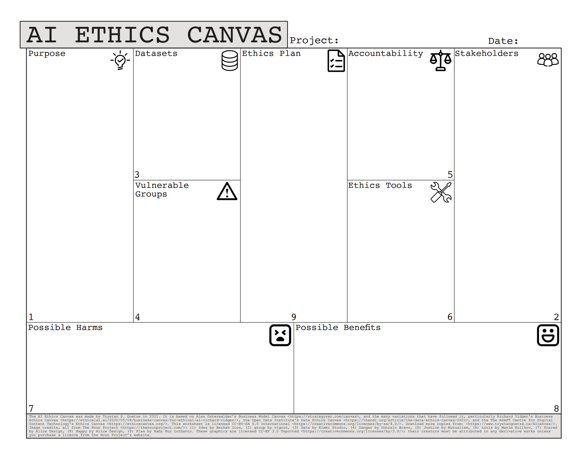

# Ethics AI Canvas

## Instructions
Work with your group to complete this canvas for the AI agent you've created. Consider all aspects thoroughly and be prepared to share your insights.

[AI Ethics Canvas, from Trystan S. Goetze](https://www.trystangoetze.ca/aicanvas.html)
[AI Ethics Canvas: Guidebook](https://www.trystangoetze.ca/uploads/1/4/5/4/145439826/ai_ethics_canvas_guidebook_v0.2.pdf)

---

### 1. Agent Purpose
**What is your agent designed to do? What problems does it solve?**

[Your response here]

**Primary users/beneficiaries:**

[Your response here]

---

### 2. Stakeholder Mapping

#### Who benefits from this agent?
* [Stakeholder 1]
* [Stakeholder 2]
* [Stakeholder 3]

#### Who might be negatively impacted?
* [Stakeholder 1]
* [Stakeholder 2]
* [Stakeholder 3]

#### Who is excluded from using or benefiting from this agent?
* [Group 1]
* [Group 2]

---

### 3. Job Impact Assessment

#### Jobs that might be transformed:
* [Job 1] - How: [Description]
* [Job 2] - How: [Description]
* [Job 3] - How: [Description]

#### Skills that become more valuable:
* [Skill 1]
* [Skill 2]
* [Skill 3]

#### New roles that might emerge:
* [Role 1]
* [Role 2]

---

### 4. Empowerment Potential

#### How does this agent democratize access to:
* Knowledge: [Your response]
* Services: [Your response]
* Opportunities: [Your response]

#### Who gains power through this agent?
[Your response here]

#### How might this agent reduce inequalities?
[Your response here]

---

### 5. Risk Mitigation

#### Potential risks:
* [Risk 1]
* [Risk 2]
* [Risk 3]

#### Mitigation strategies:
* For Risk 1: [Strategy]
* For Risk 2: [Strategy]
* For Risk 3: [Strategy]

#### Safeguards to implement:
* [Safeguard 1]
* [Safeguard 2]
* [Safeguard 3]

---

### 6. Ethical Guidelines

#### Core principles for this agent:
1. [Principle 1]
2. [Principle 2]
3. [Principle 3]

#### Red lines (things this agent should never do):
1. [Red line 1]
2. [Red line 2]
3. [Red line 3]

#### Ongoing ethical evaluation:
How will you continue to assess the ethical implications of your agent as it evolves?

[Your response here]

---

### 7. Reflection

#### The most significant ethical concern for this agent is:
[Your response here]

#### One way this agent could create unexpected positive impact:
[Your response here]

#### What needs to change in your agent design based on this canvas?
[Your response here]
